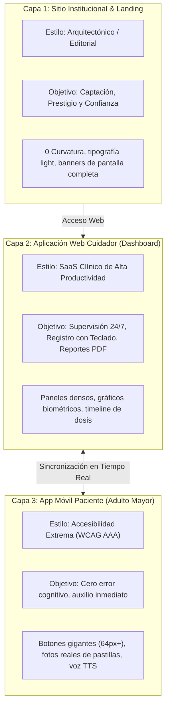

# 🏥 CONTIGO · Plataforma de Teleasistencia Médica para Adultos Mayores y Cuidadores

> **Curso:** Interacción Hombre-Máquina (IHM) · UTP 2026  
> **Proyecto:** Sistema Dual de Cuidado Asistivo y Monitoreo Geriátrico  
> **Estándar:** WCAG 2.1 AAA · Diseño Centrado en el Usuario (UCD)

---

## 📖 1. Visión General del Proyecto

**CONTIGO** es un ecosistema de teleasistencia médica diseñado para resolver la brecha de usabilidad en el cuidado del adulto mayor con enfermedades crónicas (hipertensión, polifarmacia) y apoyar la supervisión activa de sus familiares y cuidadores.

### 🌟 Arquitectura Triádica de Diseño (3 Capas)

Para sustentar con rigor ante el curso de IHM, el proyecto divide su experiencia en 3 capas especializadas según el perfil de usuario y contexto de uso:



---

## 🗂️ 2. Estructura del Repositorio

```text
HOMBRE-MAQUINA/
├── docs/                       # 📚 Documentación Maestra y Guía de Agentes
│   ├── 00-contexto-maestro.md  # Contexto general, arquitectura y estándares
│   ├── GUIA_AGENTES.md         # Reglas inmutables y prompts para Agentes de IA
│   ├── 01-arquitectura/        # Especificaciones técnicas y diagramas
│   ├── 02-base-de-datos/       # Esquemas PostgreSQL (auth, clinical, telemetry, reports)
│   ├── 04-modulos/             # Requisitos detallados de mod-00 a mod-07
│   ├── 06-ux-ui/               # Sistema de diseño, tokens, font pairing y pantallas
│   └── 08-decisiones-arquitectura/ # ADR-001 (Justificación Dual App/Web)
│
├── frontend/                   # 💻 Aplicación Web (React + TypeScript + Vite)
│   ├── src/
│   │   ├── features/           # Vistas y módulos funcionales:
│   │   │   ├── landing/        # ClinicPortalPage.tsx y ContigoLandingPage.tsx
│   │   │   ├── auth/           # LoginPage.tsx y RegisterPage.tsx
│   │   │   ├── dashboard/      # DashboardPage.tsx (KPIs, timeline, alertas)
│   │   │   ├── medications/    # MedicationsPage.tsx (Pastillero con foto)
│   │   │   ├── vitals/         # VitalsPage.tsx (Presión con Recharts)
│   │   │   ├── reports/        # ReportsPage.tsx (Generador de PDF)
│   │   │   ├── settings/       # SettingsPage.tsx (Ajustes y umbrales)
│   │   │   └── onboarding/     # LinkPatientModal.tsx (PIN 6 dígitos)
│   │   ├── services/           # apiClient.ts + Mocks realistas en memoria
│   │   ├── context/            # AuthContext y PatientContext
│   │   └── app/                # theme.ts (MUI) y configuración
│   └── .env                    # Configuración con VITE_USE_MOCKS=true
│
├── backend/                    # ⚙️ Backend (Spring Boot 3 + Java 17/21 - Para fases posteriores)
├── movil/                      # 📱 App Móvil Paciente (Módulo asistivo)
├── docker-compose.yml          # PostgreSQL 15 + Redis (Opcional)
└── README.md                   # Este documento
```

---

## 🚀 3. Cómo Ejecutar el Proyecto Frontend (Paso a Paso)

El frontend está configurado con **Mocks Inteligentes en Memoria** (`VITE_USE_MOCKS=true`), por lo que **no necesitas tener encendido el backend ni bases de datos** para probar todas las funcionalidades interactivas (pastillero, agregar pastillas, registrar presión, generar PDF y vincular paciente).

### Requisitos Previos
* **Node.js:** v18.0.0 o superior ([Descargar Node.js](https://nodejs.org/)).
* **NPM:** v9.0.0 o superior.

### Instalación y Puesta en Marcha

1. **Clonar el repositorio:**
   ```bash
   git clone https://github.com/TU_USUARIO/HOMBRE-MAQUINA.git
   cd HOMBRE-MAQUINA
   ```

2. **Entrar a la carpeta del frontend e instalar dependencias:**
   ```bash
   cd frontend
   npm install
   ```

3. **Verificar el archivo de entorno (`frontend/.env`):**
   Asegúrate de que contenga:
   ```env
   VITE_API_BASE_URL=http://localhost:8080/api/v1
   VITE_USE_MOCKS=true
   ```

4. **Iniciar el servidor de desarrollo:**
   ```bash
   npm run dev
   ```

5. **Abrir en tu navegador:**
   * 🌐 **Web de la Clínica:** `http://localhost:3000/clinic`
   * 🚀 **Landing de Contigo:** `http://localhost:3000/landing`
   * 🔐 **Login del Cuidador:** `http://localhost:3000/login`
   * 📊 **Dashboard del Cuidador:** `http://localhost:3000/dashboard`

---

## 🎨 4. Sistema de Diseño y Tokens Oficiales

* **Tipografía Oficial:**
  * **Headings / Métricas / Botones:** `Plus Jakarta Sans` (`font-heading`).
  * **Cuerpo / Tablas / Formularios:** `Inter` (`font-sans`).
* **Paleta Cromática:**
  * **Verde Salud Principal:** `#136F53` (`forest-700`).
  * **Verde Oscuro:** `#0E543F` (`forest-800`).
  * **Azul Institucional Clínica:** `#0F2942` / `#1E3A8A`.
  * **Cian Tecnológico:** `#0284C7`.
* **Geometría:** 0 Curvatura (`rounded-none` / bordes rectos nítidos) en toda la web para una estética moderna y arquitectónica.

---

## 🤖 5. Protocolo de Desarrollo para Agentes de IA

Si utilizas asistentes de IA (Antigravity, Cursor, Copilot, ChatGPT):

1. **Lectura Obligatoria:** Exige a tu agente que lea siempre primero `docs/00-contexto-maestro.md` y `docs/GUIA_AGENTES.md`.
2. **Cero Improvisación:**
   * No cambiar la paleta de colores oficial.
   * Mantener los identificadores `data-testid` en cada botón e input para pruebas automatizadas.
   * Respetar la arquitectura de servicios desacoplada en `src/services/apiClient.ts`.

---

## 👥 6. Equipo y Roles

* **Curso:** Interacción Hombre-Máquina (IHM)
* **Universidad:** Universidad Tecnológica del Perú (UTP)
* **Ciclo:** 2026

*Desarrollado con dedicación para mejorar la calidad de vida de nuestros adultos mayores y sus familias.* ❤️
