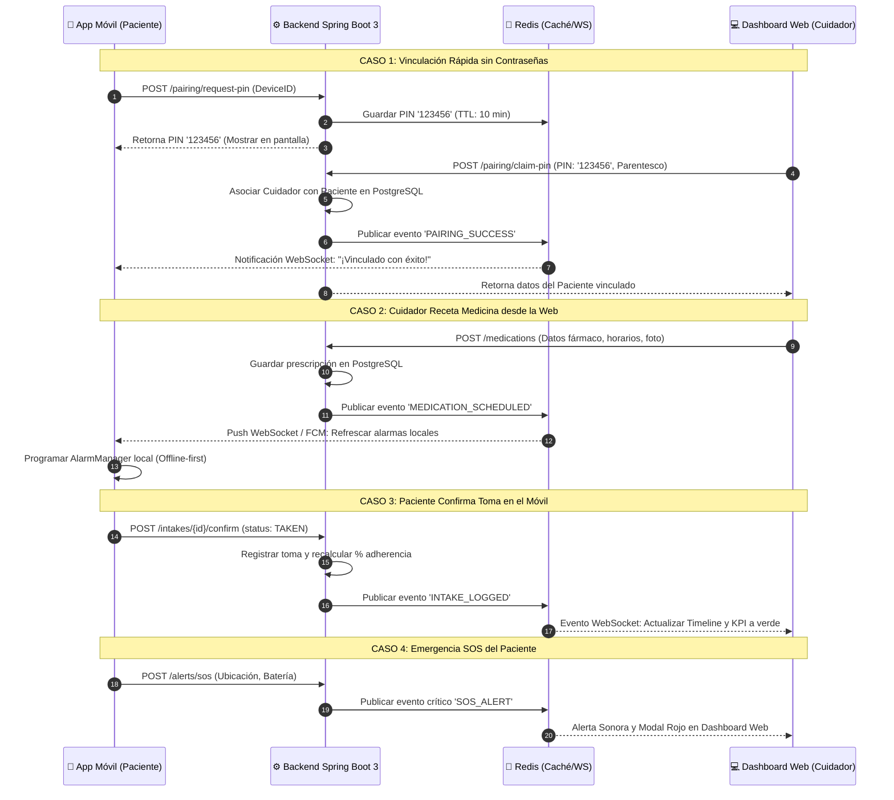

# Plan de Avance Backend: Sincronización Armónica Web ↔ Móvil

**Proyecto:** Ecosistema CONTIGO · Teleasistencia Geriátrica  
**Documento Técnico:** Especificación de Endpoints, Protocolo de Sincronización y Roadmap Backend  
**Versión:** 1.0 (2026)

---

## 1. Diagnóstico de Mejoras Identificadas (Móvil vs. Web)

A partir de la auditoría de interacción (Norman, GOMS y heurísticas de Nielsen) y los flujos originales del Figma, se definieron las mejoras estructurales que deben materializarse a nivel de backend:

### A. Mejoras en la Aplicación Móvil (Paciente Senior)
1. **Eliminación de la sobrecarga de autenticación:** Se suprime el login con correo/contraseña para el anciano. Se implementa un **mecanismo de vinculación por PIN efímero de 6 dígitos** generado en pantalla.
2. **Eliminación de selectores de rueda (*time pickers* circulares):** Reducción de deslices motores erróneos mediante la recepción de alarmas parametrizadas desde la web.
3. **Reconocimiento visual de medicamentos (Nielsen H6):** La API provee URLs directas de **fotografías reales de los comprimidos** para mostrar en la pantalla de toma.
4. **Confirmación asistiva de un toque (WCAG 2.5.5):** Botón táctil gigante (≥64px) y soporte para confirmación auditiva (TTS/STT).
5. **Botón de auxilio permanente (SOS):** Endpoint de alta prioridad para notificar caídas o descompensaciones en menos de 1 segundo al cuidador.
6. **Descarga de funciones administrativas:** Los reportes médicos densos, gráficos y configuraciones complejas se eliminan del móvil y se delegan al portal web.

### B. Mejoras en la Aplicación Web (Cuidador)
1. **Panel de telemetría y supervisión 24/7:** Visualización en vivo del estado del paciente (adherencia de hoy, última presión arterial y estado de conexión del móvil).
2. **Gestión rápida de recetas con teclado físico:** Reducción drástica del tiempo predictivo GOMS de registro (de 48.5 s en móvil a 12.3 s en web).
3. **Analítica biométrica interactiva:** Gráficos evolutivos de presión sistólica/diastólica con líneas de referencia médica (120/80 mmHg).
4. **Generador oficial de informes médicos PDF:** Exportación con formato hospitalario homologado para la consulta con el geriatra.
5. **Control remoto de accesibilidad:** Capacidad de activar/desactivar remotamente el *Modo Fácil* o la *Lectura por Voz* del celular del anciano.

---

## 2. El Reto: Modelo de Sincronización Armónica y Bidireccional

Para que el ecosistema funcione sin fricción, se establece un modelo híbrido: **REST API para operaciones transaccionales** y **WebSockets (STOMP) + Redis Pub/Sub para eventos en tiempo real**.



---

## 3. Especificación Técnica de Endpoints (API Contract)

Base URL: `/api/v1`  
Formato de Intercambio: `application/json`  
Seguridad: Bearer JWT Token en cabecera `Authorization` (para cuidador) y Token de Dispositivo (para móvil).

### 3.1. Módulo de Vinculación y Sesiones (`/pairing` y `/auth`)

#### `POST /pairing/request-pin` (Llamado por el Móvil)
Genera un PIN de 6 dígitos temporal para que el cuidador lo introduzca en la web.
* **Payload Móvil:**
  ```json
  {
    "deviceUid": "android-a1b2c3d4e5f6",
    "patientFullName": "Dacio Ramos",
    "patientAge": 78
  }
  ```
* **Respuesta (200 OK):**
  ```json
  {
    "pin": "123456",
    "expiresInSeconds": 600,
    "qrCodePayload": "contigo://pair?pin=123456&device=android-a1b2c3d4e5f6"
  }
  ```

#### `POST /pairing/claim-pin` (Llamado por la Web)
El cuidador introduce el PIN en el modal web para vincularse al teléfono del anciano.
* **Payload Web:**
  ```json
  {
    "pin": "123456",
    "relationship": "Hijo / Hija"
  }
  ```
* **Respuesta (200 OK):**
  ```json
  {
    "patientId": "pat-001",
    "fullName": "Dacio Ramos",
    "age": 78,
    "pairedAt": "2026-09-02T20:00:00Z"
  }
  ```

---

### 3.2. Módulo de Medicamentos y Prescripciones (`/medications`)

#### `GET /patients/{patientId}/medications`
Retorna el pastillero completo del paciente (para Web y Móvil).
* **Respuesta (200 OK):**
  ```json
  [
    {
      "id": "med-001",
      "name": "Losartán Potásico",
      "dosage": "50 mg",
      "formFactor": "TABLET",
      "imageUrl": "https://images.unsplash.com/photo-1584308666744-24d5c474f2ae?w=300",
      "times": ["08:00", "20:00"],
      "frequencyType": "DAILY",
      "instructions": "Tomar con abundante agua después de los alimentos.",
      "isActive": true
    }
  ]
  ```

#### `POST /patients/{patientId}/medications` (Llamado por la Web)
Permite al cuidador dar de alta un nuevo fármaco con teclado físico.
* **Payload Web:**
  ```json
  {
    "name": "Enalapril",
    "dosage": "10 mg",
    "times": ["09:00"],
    "frequencyType": "DAILY",
    "durationDays": 30,
    "instructions": "1 tableta en el desayuno",
    "imageUrl": "https://..."
  }
  ```
* **Efecto Secundario Backend:** Emite evento WebSocket `/topic/patient/{patientId}/sync` para que el móvil descargue la nueva receta y configure la alarma local.

---

### 3.3. Módulo de Tomas y Adherencia (`/intakes`)

#### `GET /patients/{patientId}/intakes/today`
Retorna el cronograma de tomas del día con fotos y estados.
* **Respuesta (200 OK):**
  ```json
  [
    {
      "id": "intake-101",
      "medicationId": "med-001",
      "medicationName": "Losartán",
      "dosage": "50 mg",
      "scheduledTime": "08:00",
      "status": "TAKEN",
      "takenAt": "2026-09-02T08:05:12Z",
      "imageUrl": "https://..."
    },
    {
      "id": "intake-102",
      "medicationId": "med-001",
      "medicationName": "Losartán",
      "dosage": "50 mg",
      "scheduledTime": "20:00",
      "status": "PENDING",
      "takenAt": null,
      "imageUrl": "https://..."
    }
  ]
  ```

#### `POST /intakes/{intakeId}/confirm` (Llamado por el Móvil al presionar "Ya tomé")
* **Payload Móvil:**
  ```json
  {
    "status": "TAKEN",
    "confirmedVia": "VOICE_RECOGNITION", // o "BIG_BUTTON_TOUCH"
    "timestamp": "2026-09-02T08:05:12Z"
  }
  ```
* **Efecto Secundario Backend:** Notifica al dashboard web para que la barra de adherencia (%) y el timeline se pongan en verde de inmediato sin refrescar la página.

---

### 3.4. Módulo de Signos Vitales y Biometría (`/vitals`)

#### `GET /patients/{patientId}/vitals/blood-pressure`
Retorna el histórico de presión y pulso para alimentar el gráfico Recharts en la web.
* **Respuesta (200 OK):**
  ```json
  [
    {
      "id": "vit-001",
      "systolic": 120,
      "diastolic": 80,
      "pulse": 72,
      "status": "NORMAL",
      "recordedAt": "2026-09-02T09:05:00Z",
      "recordedVia": "VOICE_PATIENT"
    }
  ]
  ```

#### `POST /patients/{patientId}/vitals/blood-pressure`
Registra una medición tomada con tensiómetro (desde móvil o web).
* **Payload:**
  ```json
  {
    "systolic": 135,
    "diastolic": 88,
    "pulse": 74,
    "notes": "Post-almuerzo"
  }
  ```
* **Regla de Negocio Backend:** Si `systolic > systolicMaxNormal` o `diastolic > diastolicMaxNormal`, el backend genera automáticamente un registro en la tabla de alertas y emite un evento sonoro al cuidador.

---

### 3.5. Módulo de Alertas y Botón de Auxilio SOS (`/alerts`)

#### `POST /patients/{patientId}/alerts/sos` (Llamado por el Móvil)
Disparado al tocar el botón rojo de auxilio SOS en el celular del anciano.
* **Payload Móvil:**
  ```json
  {
    "latitude": -12.0965,
    "longitude": -77.0352,
    "batteryLevel": 85,
    "timestamp": "2026-09-02T14:30:00Z"
  }
  ```
* **Efecto Secundario Backend:** Dispara notificación Push de alta prioridad (FCM) al celular del cuidador y activa alerta modal roja con sirena en el Dashboard Web abierto.

---

### 3.6. Módulo de Ajustes Clínicos y Control Remoto (`/settings`)

#### `GET /patients/{patientId}/settings` y `PUT /patients/{patientId}/settings`
Permite leer y modificar los umbrales de presión y la configuración remota del móvil.
* **Payload / Respuesta:**
  ```json
  {
    "systolicMaxNormal": 135,
    "systolicMinNormal": 100,
    "diastolicMaxNormal": 88,
    "diastolicMinNormal": 60,
    "notifyOnOutOfRange": true,
    "notifyMissedDoseMinutes": 30,
    "easyModeEnabled": true,
    "voiceGuideEnabled": true
  }
  ```
* **Sincronización:** Cuando el cuidador cambia `easyModeEnabled: true` en la web, el móvil del anciano recibe el evento y agranda instantáneamente sus botones a 64px.

---

## 4. Estrategia Offline-First para el Móvil

El adulto mayor puede quedarse sin internet o modo avión en su casa. La app móvil **no puede depender de que haya internet para que suene la alarma de su pastilla**.

1. **Almacenamiento Local en Móvil:**  
   La app móvil almacena localmente el pastillero en SQLite (Room en Android / Drift o Hive en Flutter).
2. **Alarmas Nativas del Sistema Operativo:**  
   Las alarmas se configuran con el `AlarmManager` nativo de Android, que despierta el dispositivo incluso si la app está cerrada o sin conexión.
3. **Cola de Sincronización en Lote (`Sync Queue`):**  
   Si el anciano confirma su pastilla sin internet, se marca `status: TAKEN_OFFLINE`. Cuando el teléfono recupera conectividad, llama automáticamente a:
   `POST /api/v1/sync/batch-intakes` para sincronizar las tomas pendientes con el backend.

---

## 5. Canales de WebSockets (STOMP / SockJS)

Endpoint de Conexión: `ws://localhost:8080/ws/contigo`

| Canal de Suscripción (Tópico) | Suscriptor | Eventos Transmitidos |
| :--- | :--- | :--- |
| `/topic/patient/{id}/dashboard` | **Dashboard Web** | `INTAKE_CONFIRMED`, `VITALS_LOGGED`, `SOS_ALERT`, `MOBILE_HEARTBEAT` |
| `/topic/patient/{id}/device` | **App Móvil** | `NEW_PRESCRIPTION`, `MEDICATION_PAUSED`, `SETTINGS_UPDATED`, `PAIR_CONFIRMED` |

---

## 6. Roadmap de Implementación (Plan de Trabajo por Fases)

### Fase 1: Cimientos del Backend (Spring Boot 3 + PostgreSQL)
1. Inicializar proyecto Spring Boot 3 con Maven en la carpeta `backend/`.
2. Configurar dependencias en `pom.xml`: `spring-boot-starter-web`, `spring-boot-starter-data-jpa`, `spring-boot-starter-security`, `spring-boot-starter-websocket`, `postgresql`, `flyway-core`, `jjwt`.
3. Levantar `docker-compose.yml` para tener PostgreSQL 15 y Redis 7 listos.
4. Crear scripts Flyway `V1__init_schemas.sql` con las tablas: `users`, `patients`, `caregiver_patient`, `medications`, `pill_intakes`, `vitals`, `alerts`, `clinical_settings`.

### Fase 2: Implementación de Controladores y Lógica de Negocio
1. Implementar `AuthController` y `PairingController` (Generación de PIN en Redis con TTL de 10 min).
2. Implementar `MedicationService` y `IntakeService` (CRUD de recetas con validación de horarios).
3. Implementar `VitalsService` (Registro de presión y lógica de umbrales clínicos con alertas automáticas).
4. Implementar `SettingsService` (Control remoto de accesibilidad).

### Fase 3: Conexión en Tiempo Real (WebSockets STOMP)
1. Configurar `WebSocketConfig` implementando `WebSocketMessageBrokerConfigurer`.
2. Crear eventos `IntakeEvent`, `AlertEvent` y `SyncEvent` que notifiquen a los tópicos correspondientes.
3. Probar eventos de sincronización bidireccional con Postman / Insomnia.

### Fase 4: Integración con el Frontend Web (React)
1. En `frontend/src/services/apiClient.ts`, cambiar `VITE_USE_MOCKS=false`.
2. Configurar Axios con interceptores para token JWT.
3. Integrar cliente STOMP (`@stomp/stompjs` + `sockjs-client`) en el frontend para escuchar el tópico `/topic/patient/{id}/dashboard`.

### Fase 5: Entrega del Contrato API para la App Móvil
1. Generar la documentación OpenAPI / Swagger interactiva en `http://localhost:8080/swagger-ui.html`.
2. Tu compañero que desarrolla la app móvil consumirá los endpoints aquí detallados (`/pairing/request-pin`, `/medications`, `/intakes/confirm`, `/alerts/sos`), logrando la sincronización total del ecosistema.
