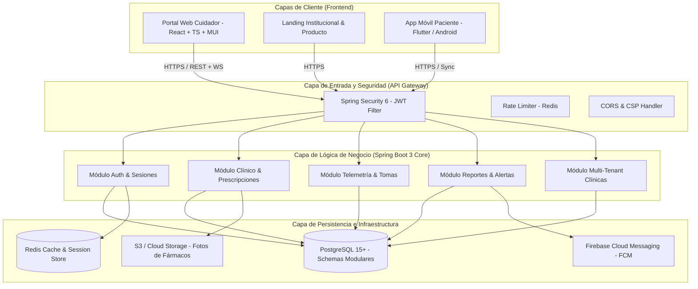

# Arquitectura Técnica del Ecosistema CONTIGO

## 1. Visión y Desacoplamiento de Capas

El ecosistema **CONTIGO** adopta una arquitectura modular distribuida orientada a servicios, optimizada para la interacción web del cuidador y la resiliencia móvil del paciente:



---

## 2. Estructura de Proyectos (Monorepo / Multi-Module)

El repositorio se organizará en una estructura limpia y modular:

```text
HOMBRE-MAQUINA/
├── docs/                             # Documentación técnica maestra
├── backend/                          # Backend Spring Boot (Maven)
│   ├── pom.xml
│   └── src/main/
│       ├── java/com/contigo/
│       │   ├── config/              # Seguridad, Redis, CORS, OpenAPI
│       │   ├── common/              # Manejo global de excepciones, DTOs base
│       │   └── modules/             # Módulos organizados por dominio
│       │       ├── auth/            # Login, registro, JWT, tokens
│       │       ├── clinical/        # Pacientes, cuidadores, vinculación
│       │       ├── prescriptions/   # Medicamentos, horarios, fotos
│       │       ├── telemetry/       # Tomas de pastillas, presión arterial
│       │       ├── reports/         # Generación de informes PDF
│       │       └── tenant/          # Gestión de clínicas / organizaciones
│       └── resources/
│           ├── application.yml
│           └── db/migration/        # Scripts SQL de Flyway (V1__...)
├── frontend/                         # Portal Web Cuidador & Landing (React + Vite)
│   ├── package.json
│   ├── vite.config.ts
│   ├── tsconfig.json
│   └── src/
│       ├── app/                     # Providers, Router, Store
│       ├── assets/                  # Iconos, imágenes, logos
│       ├── components/              # Componentes comunes (Botones, Tablas, Layouts)
│       ├── features/                # Módulos funcionales
│       │   ├── landing/             # Web institucional y acceso
│       │   ├── auth/                # Login, registro, recuperación
│       │   ├── onboarding/          # Vinculación por PIN/QR
│       │   ├── dashboard/           # Resumen y métricas en tiempo real
│       │   ├── medications/         # Pastillero digital y recetas
│       │   ├── vitals/              # Históricos de presión arterial y gráficos
│       │   ├── reports/             # Generador de reportes médicos PDF
│       │   └── settings/            # Umbrales clínicos y configuración
│       ├── hooks/                   # Hooks personalizados (useAuth, useSocket)
│       ├── services/                # Clientes Axios / Fetch con interceptores
│       └── types/                   # Tipos e interfaces TypeScript
└── docker-compose.yml                # Orquestación de PostgreSQL, Redis y Apps
```

---

## 3. Patrones de Diseño Obligatorios

1. **Backend (Spring Boot):**
   - **Repository Pattern:** Interfaces que extienden de `JpaRepository` con consultas JPQL/Nativas tipadas.
   - **Service Layer (Casos de Uso):** Lógica transaccional marcada con `@Transactional(readOnly = true/false)`.
   - **Data Transfer Objects (DTOs):** Uso de Java Records inmutables para peticiones y respuestas con validaciones `@Valid`.
   - **Global Exception Handling:** `@RestControllerAdvice` retornando respuestas consistentes bajo el estándar RFC 7807 (`ProblemDetail`).

2. **Frontend (React):**
   - **Feature-Driven Architecture:** Cada módulo contiene sus propios componentes, hooks, esquemas Zod y servicios.
   - **Custom Hooks:** Toda lógica de llamadas a API desacoplada de la vista mediante hooks de TanStack Query (`useMedications()`, `useVitals()`).
   - **Form Pattern:** Formularios encapsulados con `react-hook-form` + `zodResolver(schema)`.
